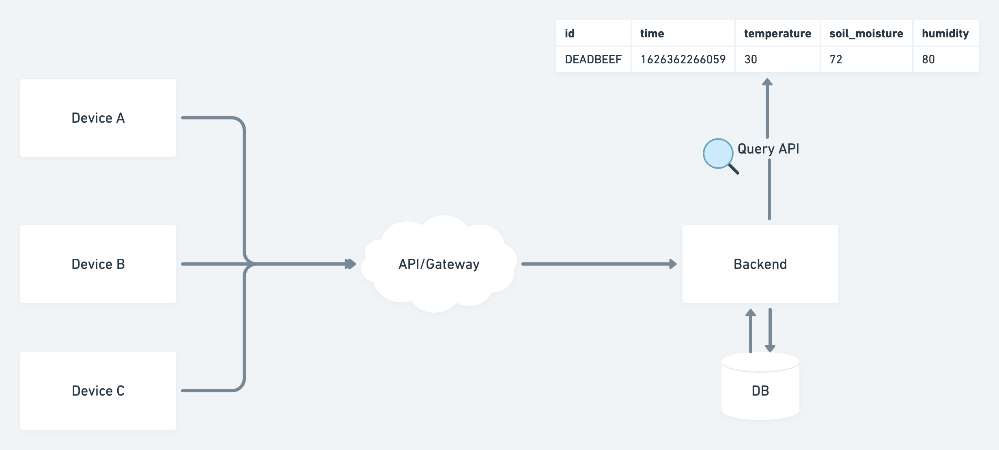

## Backend Code Challenge

### Project

A company wants to develop a home grown fresh plants monitoring system for casual users. The hardware development is still happening, but they want to make sure our backend can handle the device sending data to the cloud and that we can provide an interface to query the historical data for each device.

The device is going to send these data points:

- Identity:
  - Device/Hardware ID - can be a MAC Address for example
- Telemetry
  - Timestamp
  - Soil moisture - 0 - 100%
  - External Temperature - Cº
  - External Humidity - 0 - 100%

For us to prove that we can handle the application, we are proposing that we develop two parts here.



1. A simulated device that sends data every X seconds and after each interval, the simulation should increment the internal timestamp by one hour. This way we can easily simulate a device sending data throughout the day.

```
# Examples of running some devices with a device ID and passing parameters for interval and api
$ ./device DEADBEEF --interval 5s --api localhost:8080
# or
$ SERVER_HOST=localhost:8080 ./device ABCDBBCC --interval 10
```

2. A API/Gateway that receives data from that device, identify that device, saves the historical information and have an endpoints to query the data within a time range.

Feel free to add or change things on top of that idea. For example, you can add a way for devices to authenticate or be authorized to send data, spin up multiple simulated devices with a range of IDs and so on. For the current environment information on the device, you can a use a third party API for that like DarkSky or OpenWeatherMap.

Share your solution via URL to your git repository and would be cool to either deploy it somewhere or send a video of it working. Don’t need to voice over on top of it or do anything fancy. Loom is a nice tool for that.

### Requirements

- Build using Go language
- You can choose any database or method for saving the information, don't worry about performance. It can be a file, a SQL database or any NoSQL family.
- No strict requirements for the API - Can be and Rest API, gRPC, GraphQL or others
- No strict requirement on how the device should communicate to the Cloud - Can be raw packets using TCP/UDP or a more standard protocol like HTTP, MQTT or CoAP.

### Hints

- Third-party libraries are allowed.
- As a company, we believe that communication is the key to success. So if something is not clear to you, or if you have doubts on what you can use, reach the devs.

### Happy coding!


#### References

- https://medium.com/@Ari_n/8-weather-api-alternatives-now-that-darksky-is-shutting-down-42a5ac395f93
- https://openweathermap.org/current
